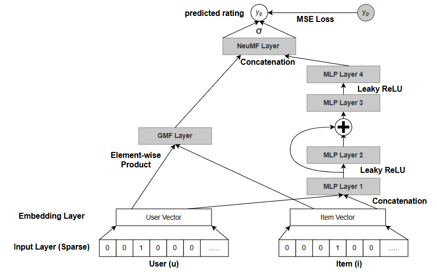
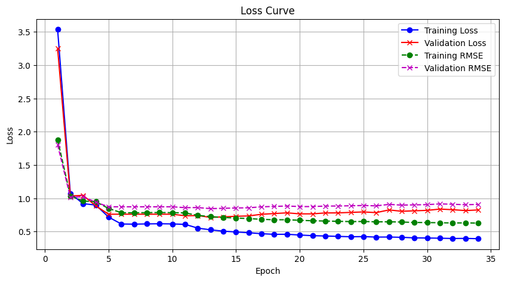
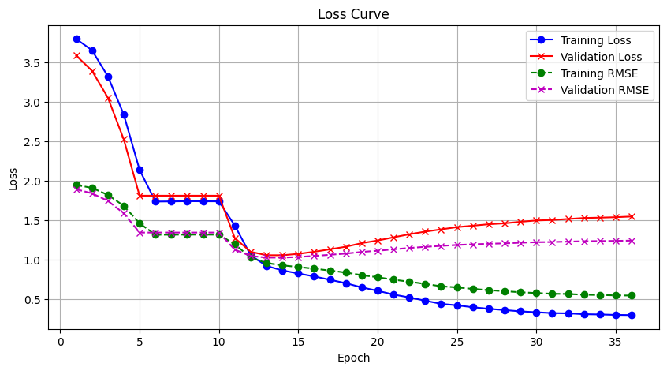
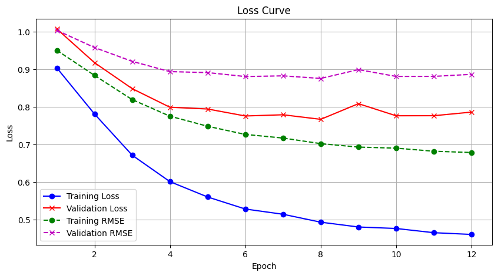
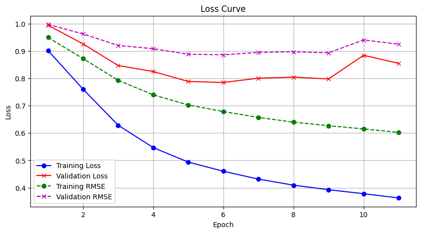

# COMP4332 Project 1 Report

**Group 5:** YUNG Ka Shing (Andy), ZHAO Yubo (Knox), Tam Kiu Wai (Kelvin), Nguyen Kim Hue Nam (Newt)

## 1. Introduction

This report details our methodology and results for the movie rating prediction task. Our best-performing model (**Neural CF with Shared Embeddings**) achieved an **RMSE** of **0.8441** on the validation set.

## 2. Neural CF Model

### 2.1 Data Analysis and Cold Start Problem

We began by analyzing the validation and test sets to understand the prevalence of new users and items:

```python
# Validation set analysis:
Number of rows in validation set with both ProductID and ReviewerID not in training set: 42
Number of rows in validation set with only ProductID not in training set: 1101
Number of rows in validation set with only ReviewerID not in training set: 359
length of new users: 47
length of new items: 302
ratio: 6.425531914893617
```
This analysis revealed an imbalance in the cold-start problem, which informed our masking strategy.

<!-- Our implementation's core innovation was the effective initialization and learning of **embeddings** to capture user preferences and item characteristics, with a specialized approach for handling unseen entities. -->

### 2.2 Data Preprocessing
1. **ID Encoding**: Converting categorical IDs to numerical indices with index 0 reserved for unknown entities
2. **Text-based Embeddings**: Initializing user and item embeddings using the lightweight `avsolatorio/GIST-small-Embedding-v0` text encoder
3. **Cold Start Handling**: Special embeddings for unknown users/items based on encoding "Unknown_User" and "Unknown_Item"

### 2.3 Model Architecture
2 complementary components: **GMF** and **MLP**.

2 distinct embedding approaches for users and items:
1. **Lookup Table Approach**: Using standard `torch.nn.Embeddings` for both reviewers and products
2. **Lookup Table with Text Encoder**: Employing a text encoder for both user and item embeddings, and a lookup table for reviewer embeddings

The 2nd one outperformed the 1st one, reducing RMSE from 0.9 to **0.8441**. For text encoding, we selected the lightweight **`avsolatorio/GIST-small-Embedding-v0`** model from Hugging Face's MTEB Leaderboard.

#### 2.2.3 Embedding Initialization Details

1. **User Embedding Initialization**
    1. **Group the reviews** according to the reviewer ID
    2. Use a small but accurate enough text embedding model **'avsolatorio/GIST-small-Embedding-v0'** from hugging face to create initial user embeddings of size **384** based of their reivews
    3. Since there will be **unseen users** in validation and test set, their intial embedding will be encoded based on the text **"Unknown_User"**
2. **Item Embedding Initialization**
    1. **Remove features** with empty values in the product information data
    2. **Remove "main_cat"** features as all product shares same values
    3. Use the text embedding model **'avsolatorio/GIST-small-Embedding-v0'** to create initial item embeddings of size **384** based of their product information
    4. Since there will be **unseen items** in validation and test set, their intial embedding will be encoded based on the text **"Unknown_Item"**

### 2.3 Model Architecture (focus on 2nd param sets)

Neural CF has 2 complementary components:

1. **Generalized Matrix Factorization (GMF)**
2. **Multi-Layer Perceptron (MLP)**

The specific architecture includes:
- Shared **embeddings** for users and items (384-dimensional)
- **GMF path**: Element-wise multiplication of user and item embeddings, followed by a linear layer to produce a scalar output
- **MLP path**:
  - Concatenation of user and item embeddings as input (768-dimensional)
  - Multiple fully-connected layers with decreasing dimensions (384 → 192 → output)
  - **Layer normalization** before each fully-connected layer
  - **LeakyReLU** activation (alpha=0.1) for non-linearity
  - **Dropout** rates starting at 0.6 for strong regularization
  - Skip connections to improve gradient flow
- **Fusion layer**: Concatenation of GMF and MLP outputs, followed by a linear layer
- Final activation: Modified **sigmoid** (scaled to output range [1, 5]): `1 + 4 * torch.sigmoid(x)`

Model architecture:



### 2.4 Training Process

Our training strategy incorporated several advanced techniques:

- **Loss function**: MSELoss
- **Optimizer**: **AdamW**
- **Learning rate**: Different learning rates for different parameters - smaller learning rate of 1e-4 for user and item embeddings (as they are generated from pretrained models), and higher learning rate for other parameters
- **Learning rate scheduler**: Three-stage strategy with `warmup_lr_scheduler` for first 5 epochs, fixed rate until 20 epochs, and finally `CosineAnnealingLR` for remaining epochs
- **Masking Input data**: The input user ID and item ID are masked as 0 (i.e., Unknown user or item) with probability 0.05 and 0.3 respectively to mimic unseen users and items in validation and test sets

<!-- [Photo: Learning Rate Schedule] -->



### 2.5 Evaluation Results

Our Neural CF model achieved an **RMSE** of **0.8441** on the validation set at epoch 13. Below is a condensed training log:

```
Epoch 1/50 -- Train RMSE: 1.8807  Val RMSE: 1.8026
Epoch 5/50 -- Train RMSE: 0.8467  Val RMSE: 0.8719
Epoch 11/50 -- Train RMSE: 0.7796  Val RMSE: 0.8586
Epoch 13/50 -- Train RMSE: 0.7249  Val RMSE: 0.8441 ← Best result
```

## 3. Alternative Approaches

### 3.1 Failed Neural CF trial

This time the model architecture remain teh same for Neural CF with GMF, but different architecture for MLP. Also, GMF and MLP use different item and user embeddings.

This approach achieved an Validation RMSE of **1.0292**

For details, please refer to 3rd sets of parameter in the notebook.



### 3.2 Failed Trial on Deep model
For users, we employed **"meta-llama/Meta-Llama-3.1-8B-Instruct-Turbo"** to summarize user preferences, then converted these summaries to **384-dimensional** embeddings using **'all-MiniLM-L6-v2'**. 

For products, we extracted the main category as the last category that is not an HTML artifact and brand from `product.json`. Our architecture combined embeddings for users, items, user features, categories, and brands, processing them through three MLP layers before applying a modified sigmoid activation `1 + 4 * torch.sigmoid(x)`. This approach yielded a validation RMSE of **0.8858** without input masking, which improved to **0.8756** when we implemented masking strategies.

with input masking:



without input masking:



### 3.3 Failed Wide and Deep Model

We also experimented with a Wide and Deep model approach, which achieved a validation RMSE of **0.878**. This was another alternative approach that didn't outperform our best model.

## 4. Conclusion

| Model | Description | Validation RMSE |
|-------|-------------|----------------|
| Neural CF with Shared Embeddings | Best model with text-initialized embeddings and masking strategy | **0.8441** |
| Neural CF with Separate Embeddings | Modified Neural CF with separate embeddings | **1.0292** |
| Deep Model with LLM | Deep network using LLM features | **0.8756** |
| Wide and Deep Model | Combination of wide linear model and deep neural network | **0.878** |

The best model is **Neural CF with Shared Embeddings**, with an RMSE of **0.8441** on the validation set.
<!-- Our results demonstrate that carefully designed shared embeddings with strategic initialization and training outperform more complex or specialized architectures. The most effective approach combines **representation learning** (shared embeddings), **transfer learning** (text-based initialization), and **data augmentation** (masking strategy). -->